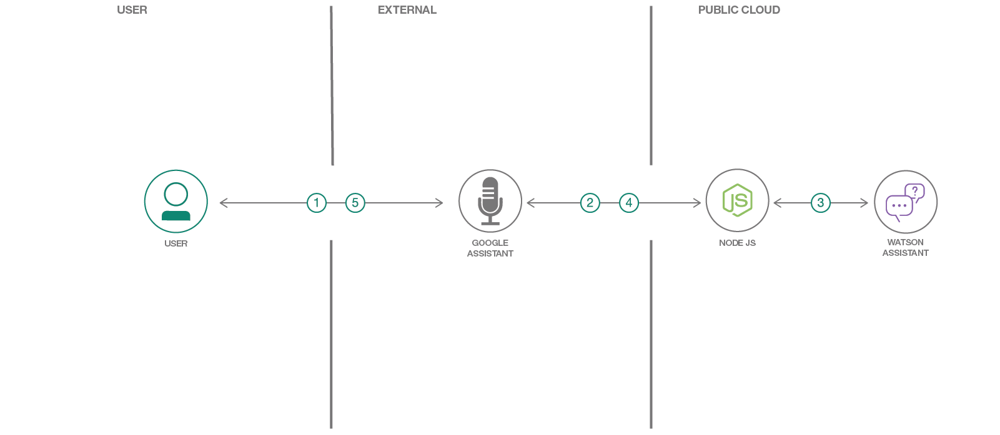

# WARNING: This repository is no longer maintained :warning:

> This repository will not be updated. The repository will be kept available in read-only mode. 

# Create an Action for Google Assistant using Watson Assistant

This code pattern includes a Watson Assistant workspace to demonstrate an implementation of a retail agent that can ask for reservation schedules and specifics. To demonstrate how to test it with Google Assistant devices, we will setup a Google Action that calls out to our Node.js server which interacts with Watson Assistant.

When the reader has completed this code pattern, they will understand how to:

* Create a Google Assistant Action
* Create a Node.js Express web application
* Deploy the Node.js app with Red Hat OpenShift or Cloud Foundry on IBM Cloud
* Interact with Google Assistant and Watson Assistant
* Use the conversation token to maintain the context
* Leverage the content catalog for general, customer care, and bot control intents
* Handle digressions during a conversation



## Flow

1. User talks or types to Google Assistant.
2. Google Assistant posts text to an HTTPS endpoint.
3. Node.js server calls Watson Assistant to get the response.
4. The response is returned to Google Assistant.
5. Google Assistant replies to the user.

## Watch the Video

[](https://youtu.be/no0R0bSkHXc)

# Steps

1. [Deploy the server](#deploy-the-server)

1. [Setup Google Actions](#setup-google-actions)

1. [Talk to it!](#talk-to-it)

## Deploy the server

Click on one of the options below for instructions on deploying the Node.js server.

[](doc/source/openshift.md) [](doc/source/cf.md)

## Setup Google Actions

1. Go to [Actions on Google Developer Console](https://console.actions.google.com)

1. Create your project
   * Click on `New project`
   * Enter a project name
   * Choose the default language for your Actions
   * Select your country or region
   * Click on `Create project`
   * Click on the `Actions SDK` card
   * Click `OK`

1. Set the invocation name

   * Under `Quick setup`, click `Decide how your Action is invoked`.
   * Enter a display name. Users will say or type this name to explicitly invoke your action.
   * Hit `Save`.

1. Obtain your project ID
   * Click on the vertical 3 dots next to your account avatar and go to `Project settings`.
   * Save the `Project ID` to use later.

1. Clone the repo

   Clone the `watson-google-assistant` repo locally. In a terminal, run:

   ```bash
   git clone https://github.com/IBM/watson-google-assistant
   ```

1. Install the `gactions` CLI
   * Download the `gactions` CLI from [here](https://developers.google.com/actions/tools/gactions-cli).
   * `chmod` the `gactions` file to make it executable.
   * Copy the `gactions` file into your local repo's `actions` directory.
     ```bash
     # For example, depending on your download and repo directories...

     chmod +x ~/Downloads/gactions
     cp ~/Downloads/gactions ~/watson-google-assistant/actions/
     ```

1. Edit `url` in the `actions/action.json` file in your local repo.

   * If you deployed with OpenShift, use the URL you saved at the end of the OpenShift deployment (from a TLS secure `Hostname`).

   * If you deployed with Cloud Foundry, use your app URL.

   > Note: The URL must have an `https://` prefix!

1. Create the action using the CLI
   > Note: If/when it prompts you to enter an authorization code, browse to the provided URL to login and authorize the CLI to use your account and copy/paste the auth code at the prompt.

   * Run the `gactions` command to update your action and prepare it for testing. Use the project ID you saved earlier.

     ```bash
     cd ~/watson-google-assistant/actions/
     ./gactions update --action_package action.json --project <YOUR_PROJECT_ID>
     ./gactions test --action_package action.json --project <YOUR_PROJECT_ID>
     ```

## Talk to it!

1. Test it in the simulator

   * Go back to your Actions on Google Developer Console
   * Use the `Test` tab and start testing
   * Type in the `Input` box or click on the microphone icon to use voice input
   * Say "Talk to my test app" or "Talk to \<your app name\>" to initiate the conversation

1. Try it with your phone, your Google Home, or other device

   * Log into the device with the same account you used to create your test app
   * Say "Hey Google, talk to \<your app name\>"
   * Alternatively, test the implicit invocation with "Hey Google, get me some wheels" or "Hey Google, rent a car"

1. Chat and fill in the "slots" using natural language

1. Try some "digressions" such as:

   * Positive or negative feedback
   * Ask to talk to the manager
   * Are you a human?
   * Do you know any jokes?
   * Store hours
   * Store locations

1. If you want to submit the app for approval, follow Google's process documented [here](https://developers.google.com/actions/sdk/submit)

## Sample output

### Testing with the simulator


## Troubleshooting
If you get an error on your Cloud Foundry deployment, please see this [issue](https://github.com/IBM/watson-google-assistant/issues/36). You will need to add environmental variables to your CF app, and then once you do that, the app will restart automatically and it should work as intended.

## License

This code pattern is licensed under the Apache License, Version 2. Separate third-party code objects invoked within this code pattern are licensed by their respective providers pursuant to their own separate licenses. Contributions are subject to the [Developer Certificate of Origin, Version 1.1](https://developercertificate.org/) and the [Apache License, Version 2](https://www.apache.org/licenses/LICENSE-2.0.txt).

[Apache License FAQ](https://www.apache.org/foundation/license-faq.html#WhatDoesItMEAN)
