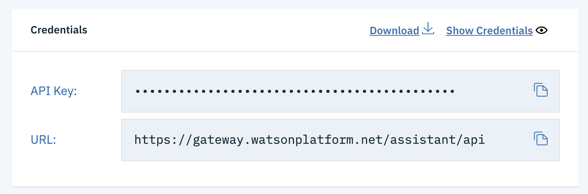
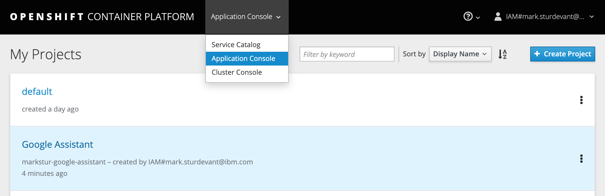

# Run on Red Hat OpenShift

This document shows how to deploy the server using Red Hat OpenShift.

## Prerequisites

You will need a running OpenShift cluster, or OKD cluster. You can provision [OpenShift on the IBM Cloud](https://cloud.ibm.com/kubernetes/catalog/openshiftcluster).

## Steps

1. [Create your Watson Assistant service](#1-create-your-watson-assistant-service)
1. [Create an OpenShift project](#2-create-an-openshift-project)
1. [Create the config map](#3-create-the-config-map)
1. [Get a secure endpoint](#4-get-a-secure-endpoint)

## 1. Create your Watson Assistant service

* [Click here](https://cloud.ibm.com/catalog/services/watson-assistant) to go the Watson Assistant create resource page.
* Review the settings. The defaults and a **Free** plan should work.
* Click `Create`.
* Copy/paste the `API Key` and `URL` or keep the browser tab open. You'll need these later.  
  

## 2. Create an OpenShift project

* Using the OpenShift web console, select the `Application Console` view.

  

* Use the `+Create Project` button to create a new project, then click on your project to open it.

* In the `Overview` tab, click on `Browse Catalog`.

  

* Choose the `Node.js` app container and click `Next`.

  

* Give your app a name and add `https://github.com/IBM/watson-google-assistant` for the github repo, then click `Create`.

  

## 3. Create the config map

* Click on the `Resources` tab and choose `Config Maps` and then click the `Create Config Map` button.
  * Provide a `Name` for the config map.
  * Add a key named `ASSISTANT_APIKEY` and paste in the API Key from step 1 under `Enter a value...`.
  * Click `Add Item` and add a key named `ASSISTANT_URL` and paste in the URL from step 1 under `Enter a value...`..
  * Click `Add Item` and add a key named `PORT`, enter 8080 under `Enter a value...`.
  * Hit the `Create` button.
  * Click on your new Config Map's name.
  * Click the `Add to Application` button.
  * Select your application from the pulldown.
  * Click `Save`.

* Go to the `Applications` tab, choose `Deployments` to view the status of your application.

## 4. Get a secure endpoint

* From the OpenShift or OKD UI, under `Applications` ▷ `Routes` you will see your app.
  * Click on the application `Name`.
  * Under `TLS Settings`, click on `Edit`.
  * Under `Security`, check the box for `Secure route`.
  * Hit `Save`.
* Go back to `Applications` ▷ `Routes`.
  * Click your app's `Hostname`. You should see the message: "Watson for Google Assistant app is running."
  * Save this URL to use later in your actions/action.json file. **It must start with https**.

